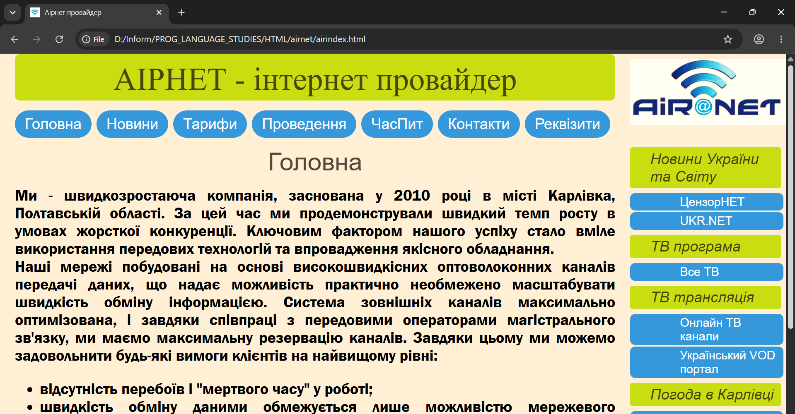
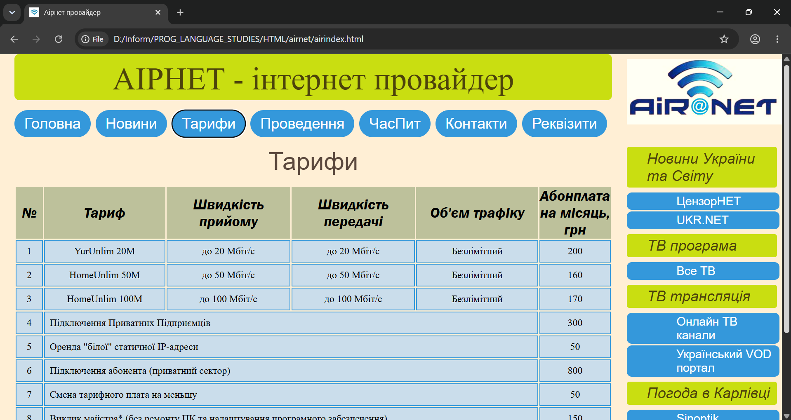

# 🌐 AirNet ISP — Web Platform & Administrative Portal


An all-in-one web platform and subscriber interaction portal designed for **AirNet**, a regional Internet Service Provider operating in Karlivka, Poltava Region, Ukraine. 

This platform serves as the central hub for prospective and existing subscribers, offering interactive service catalogs, coverage validation, technical setup tutorials, network news announcements, and billing transparency.




---

## 📋 Table of Contents

- [Overview](#-overview)
- [Architecture & Design Pattern](#-architecture--design-pattern)
- [Directory & File Structure](#-directory--file-structure)
- [Detailed Module Breakdown](#-detailed-module-breakdown)
  - [1. Core Routing & SPA Engine](#1-core-routing--spa-engine)
  - [2. News & Interactive Feed (`novyny.css`)](#2-news--interactive-feed-novynycss)
  - [3. Tariffs & Pricing Matrix (`taryfy.css`)](#3-tariffs--pricing-matrix-taryfycss)
  - [4. Coverage & Deployment Directory (`provedeno.css`)](#4-coverage--deployment-directory-provedenocss)
  - [5. Knowledge Base & FAQ (`chaspyt.css`)](#5-knowledge-base--faq-chaspytcss)
  - [6. Customer Support & Feedback (`contacts.css`)](#6-customer-support--feedback-contactscss)
  - [7. Banking & Payment Details (`rekvizyty.css`)](#7-banking--payment-details-rekvizytycss)
- [Media Assets & External Widgets](#-media-assets--external-widgets)
- [Installation & Deployment](#-installation--deployment)
- [Browser Compatibility](#-browser-compatibility)
- [Future Roadmap & Improvements](#-future-roadmap--improvements)

---

## 🔎 Overview

The **AirNet** platform delivers a fast, low-overhead browsing experience specifically targeted at modern broadband and optical fiber (FTTH) network subscribers. 

Key user goals solved by this platform:
* **Instant Information Access:** Zero page reload latency when switching between platform modules.
* **Service Transparency:** Clear tariff tier comparisons, optical equipment connection fees, and coverage verification.
* **Self-Service Support:** Step-by-step technical documentation (e.g., FTP setup, FileZilla configuration) reducing customer support load.
* **Payment Guidance:** Full financial and banking details for automated banking apps (e.g., Privat24, Monobank).

---

## 🏗 Architecture & Design Pattern

The application utilizes a lightweight **Single Page Application (SPA)** architectural pattern built entirely on native web standards without external framework overhead (Zero Dependencies):

* **Modular CSS Architecture:** Rather than bloating a single global stylesheet, the project isolates domain-specific layout rules into dedicated sub-stylesheets inside `links/`.
* **State Management via DOM Switching:** Tab navigation is driven by custom Vanilla JavaScript routines that conditionally alter CSS display properties (`display: none` / `display: block`) across semantic `<section>` containers.
* **Unobtrusive JavaScript Integration:** Event handlers (e.g., accordion toggles for news articles) attach asynchronously after the `DOMContentLoaded` event fires.

---

## 📁 Directory & File Structure

```text
airnet/
├── airindex.html          # Primary DOM entrypoint & SPA container
├── airmain.css            # Master stylesheet (global resets, typography, layout grid, sidebar)
├── fotomain/              # Asset storage (branding, icons, inline guides)
│   ├── icon.png           # Platform Favicon (shortcut icon)
│   ├── main3.png          # Primary promotional sidebar banner
│   ├── chaspyt.png        # Technical guide screenshot 1 (FileZilla Site Manager setup)
│   └── chaspyt1.png       # Technical guide screenshot 2 (FileZilla Connection settings)
└── links/                 # Modular CSS stylesheets linked inside <head>
    ├── novyny.css         # Styling for news cards, timestamps, and expandable content
    ├── taryfy.css         # Data tables for pricing tiers, speed metrics, and features
    ├── provedeno.css      # Grid/List styles for coverage maps & connected street lists
    ├── chaspyt.css        # Accordion components and step-by-step tech guides
    ├── contacts.css       # Layout for support channels, contact forms, and office info
    └── rekvizyty.css      # Reusable styled cards for banking & payment details