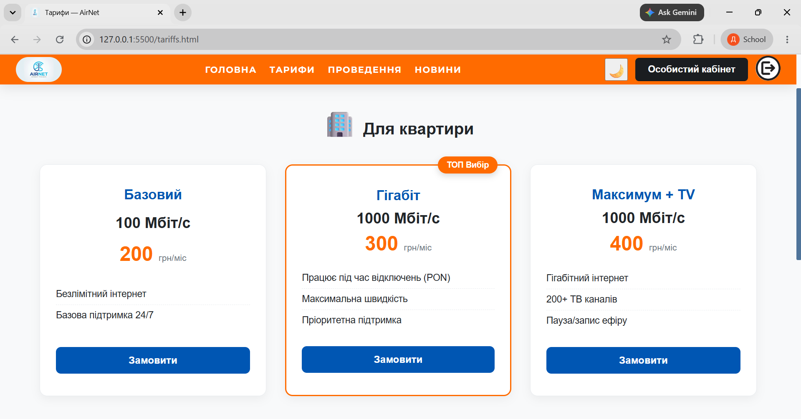
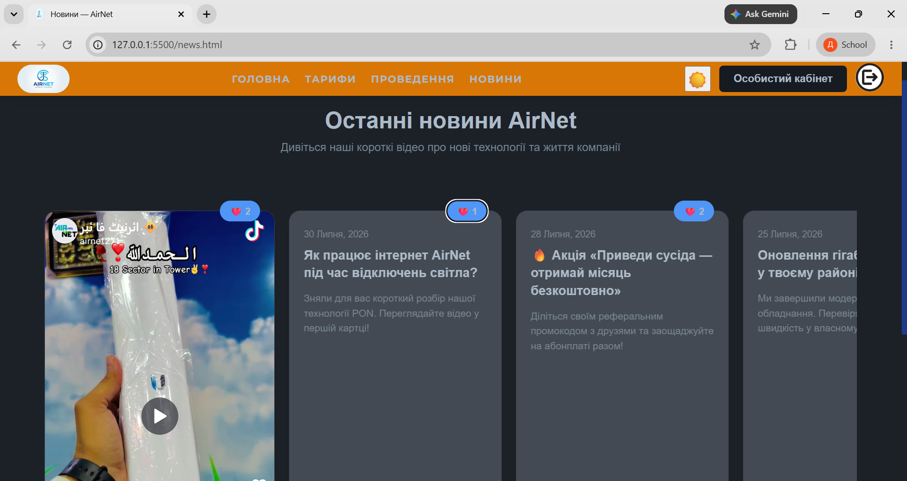
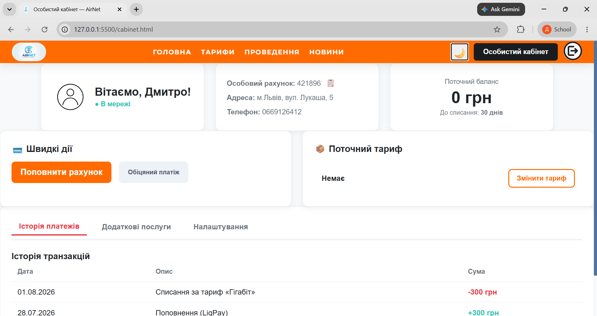
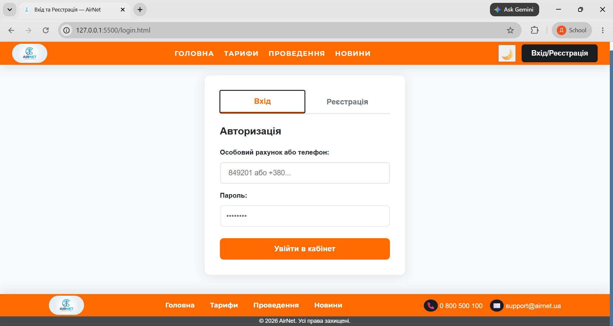
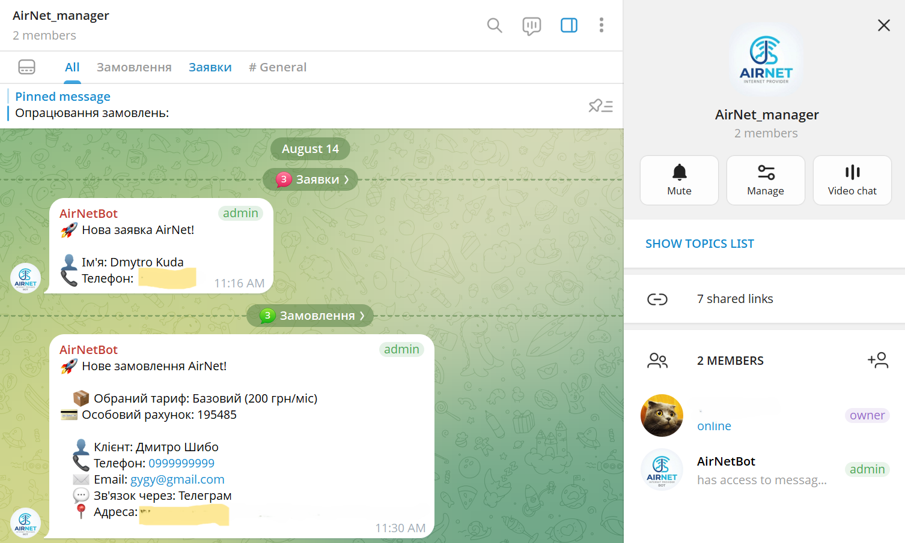

# 🌐 ISP Website Prototype

A modern, multi-page frontend prototype for an Internet Service Provider (ISP) platform built with vanilla **JavaScript (ES6+)**, **HTML5**, and modular **CSS3**.

---


## ✨ Key Features

- **🎨 Dynamic Theme Switcher:** Light and Dark mode toggling with `localStorage` persistence and system color scheme preference detection.
- **🧩 Component-Based Architecture:** Modular HTML loading (`Header`, `Footer`) powered by Vanilla JS `fetch()`.
- **💳 Personal User Cabinet:** Tabbed interface with account status, active plan information, balance overview, and settings.
- **📦 Interactive Tariffs & Ordering:** Responsive tariff cards, pricing displays, and streamlined order request flow.
- **📰 News & Updates Section:** Horizontal news carousel for corporate announcements and promotional updates.
- **📱 Fully Responsive:** Mobile-first layout designed to look seamless across smartphones, tablets, and desktops.

## 📸 Preview









---

## 🛠️ Tech Stack

- **HTML5** – Semantic element structure
- **CSS3** – Custom properties (CSS variables), Flexbox, CSS Grid
- **JavaScript (Vanilla ES6+)** – Modules (`import`/`export`), DOM manipulation, Async/Await

---

## 📂 Project Structure

```text
├── components/         # Reusable HTML layout snippets (header, footer)
├── auth.css            # Authentication forms styling
├── cabinet.css         # Personal cabinet UI styling
├── components.css      # Header and footer component styles
├── index.css           # Hero banner and advantages section styles
├── installation.css    # Coverage check and installation steps styles
├── news.css            # News carousel styles
├── order.css           # Service order page layout
├── style.css           # Main CSS entry point & global CSS variable definitions
├── tariffs.css         # Tariffs grid and card layout
├── auth.js             # Authentication logic & tab switching
├── cabinet.js          # User cabinet state & interaction handling
├── main.js             # Application initialization & global event listeners
├── news.js             # News carousel functionality
├── tariffs.js          # Tariff data rendering and selection
├── telegram.js         # Telegram notification / form submission handler
└── index.html          # Main landing page